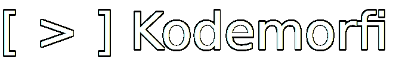

# Kodemorfi
Kodemorfi is a markup language inspired by Markdown.\
There isn't a lot of features for now.
# How to use
Create a new file and call it `main.km`. In it, use these characters to start a sentence with proprieties:\
**\\**: Escape character\
**#**: Make a big text\
**[size]**: Use custom text size (for example: [5] or [0.6])\
**-**: Use a separator\
You can put properties in a word like this: `/proprety/word\`. Here are the properties:\
**b**: Bold word\
**i**: Italic word\
**u**: Underlined word\
For example, to make the world `hello!` bold, you can use `/b/hello!\`.
***
Then, execute Kodemorfi. If everything went right, you should see a `kodemorfi_output.html` file.\
The output should look like this:
```plaintext
Kodemorfi vD-8.06.24
Reading file... Done
Line 1: Big text. Computing... Done
Line 3: Custom size text. Computing... Done
Line 5: Big text. Computing... Done
Line 6: Custom size text. Computing... Done
HTML:
<!-- Generated by Kodemorfi vD-8.06.24 --><h1>Hello there!</h1><p>This is a simple file for Kodemorfi</p><p style="font-size: 0.6em">This is a small text</p><p>And this is a normal text</p><h1>Big text!</h1><p style="font-size: 0.5em">That's all there is... for now</p>
Writing file... Done
```
See the example file to see how the propreties can be used.
